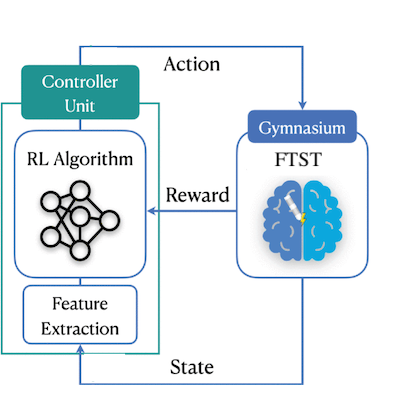

#  NeuroLoop

_Closed-Loop Deep-Brain Stimulation for Controlling Synchronization of Spiking Neurons._

<p align="center">
    
  <br>
  <em>The overall architecture of this work.</em>
</p>

## Example Usage

```sh
git submodule update --init --recursive
pip install -r requirements.txt
pip install ./dbsenv

python src/run_env_cls.py
tensorboard --logdir ./ppo_tensorboard

# open http://localhost:6006/ to visualize training results in TensorBoard.
```

## Related Repositories

- **[ftsts-ol](https://github.com/ftsts/ftsts-ol)** - implementation based on original open-loop regime.
- **[dbsenv](https://github.com/ftsts/dbsenv)** - custom OpenAI Gym environment for simulating closed-loop DBS.

## Literature

- **[ftsts](https://doi.org/10.3389/fncom.2019.00061)** - original work on open-loop stimulation regime.
- **[ftsts _(post-ictal)_](https://doi.org/10.3389/fncom.2023.1084080)** - extension of original work to target post-ictal desynchronization.
- **ftsts _(pi)_** - extension of original work to close the loop using proportional-integral (PI) control. _(contact for material)_
- **[rl driven cl-dbs](https://doi.org/10.1109/tnsre.2024.3465243)** - a study on using reinforcement learning agents for adaptive parameter control in a closed loop DBS environment based on the basal ganglia-thamalic (BGT) model.
